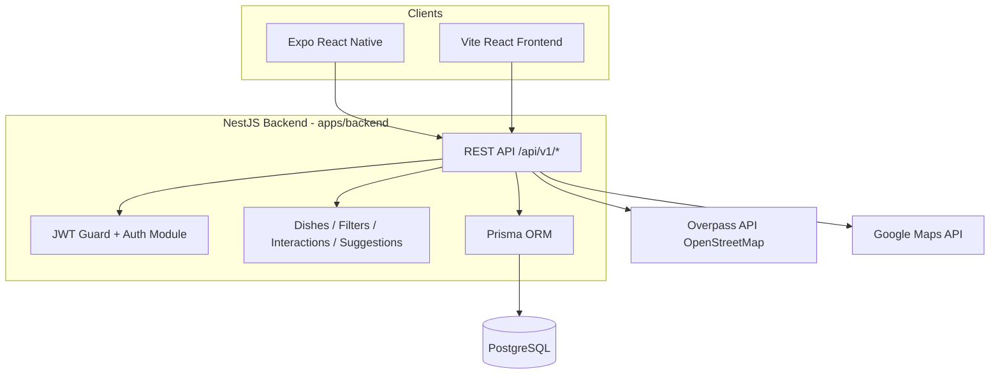

# Bao cao — Muc 4, 6, 7, 8 (du an Tinner)

Tai lieu nay mo ta Implementation Details, System Architecture, Web Service Design, va Deployment Strategy cho du an Tinner duoc to chuc theo monorepo pnpm.

## 4. Implementation Details

### 4.1 Cong nghe va cau truc monorepo

- Package manager: `pnpm` (workspace), Node.js 22+.
- Cau truc chinh:
  - `apps/backend`: NestJS + Prisma + PostgreSQL.
  - `apps/mobile`: Expo React Native.
  - `packages/types`: DTO/enums dung chung.
  - `packages/api-client`: typed API client dung cho ung dung mobile.
  - `frontend`: web tham chieu dung Vite + React.

### 4.2 Backend implementation (`apps/backend`)

- Language: TypeScript.
- Framework: NestJS 11.
- Database access: Prisma 7 voi PostgreSQL (`schema.prisma`).
- Auth stack:
  - JWT (`@nestjs/jwt`, `passport-jwt`).
  - Password hashing bang `bcrypt`.
  - Global guard (`APP_GUARD` + `JwtAuthGuard`) trong `AppModule`.
- API hardening:
  - `ValidationPipe` global (transform + whitelist + forbidNonWhitelisted).
  - `HttpExceptionFilter` global.
  - `cookie-parser`, CORS (`origin: true`, `credentials: true`).
- Modules chuc nang chinh:
  - `AuthModule`
  - `DishesModule`
  - `FiltersModule`
  - `InteractionsModule`
  - `SuggestionsModule`
- Health endpoint: `GET /api/v1/health`.

### 4.3 Mobile implementation (`apps/mobile`)

- Nen tang: Expo SDK 54, React 19, React Native 0.81.
- Navigation: `@react-navigation/native`, `native-stack`.
- Tich hop mobile:
  - `expo-location` cho du lieu vi tri.
  - `expo-secure-store` cho thong tin nhay cam.
- Bien moi truong API base URL: `EXPO_PUBLIC_API_BASE_URL` (doc tu `README.md`).

### 4.4 Web frontend tham chieu (`frontend`)

- Build tool: Vite 6.
- Stack: React + Tailwind + bo thu vien UI.
- Vai tro: giao dien tham chieu/co the deploy rieng tren Vercel.

### 4.5 Local dev va cong cu

- Chay local stack bang Docker Compose:
  - `postgres` (`postgres:16`)
  - `backend` build tu `apps/backend/Dockerfile`
- Script monorepo quan trong:
  - `pnpm dev:backend`
  - `pnpm dev:mobile`
  - `pnpm docker:up`, `pnpm docker:down`, `pnpm docker:logs`
  - `pnpm deploy:render:validate`
- Testing:
  - Backend dung Jest, co `test`, `test:cov`, `test:e2e`.

## 6. System Architecture Diagram

### 6.1 Mo ta kien truc tong quan

He thong theo huong client-server:

1. Client layer:
   - Mobile app (Expo React Native) la client chinh.
   - Web frontend (Vite React) co the dung nhu kenh giao dien bo sung/demo.
2. API layer:
   - Backend NestJS expose REST endpoints theo prefix `/api/v1/*`.
   - Cac module nghiep vu duoc tach theo domain (auth, dishes, filters, interactions, suggestions).
3. Data layer:
   - PostgreSQL la nguon du lieu trung tam.
   - Prisma la lop ORM va schema quan ly model/migration.
4. Third-party integration:
   - Overpass API (OpenStreetMap) cho truy van nha hang theo tag `amenity` trong ban kinh dia ly (khong can API key, chi can `User-Agent`).
   - Google Maps API key trong cau hinh production (`render.yaml`).

### 6.2 So do kien truc (Mermaid)

## 7. Web Service Design

### 7.1 Kieu dich vu va convention

- Kieu dich vu: REST API (khong thay GraphQL trong repo hien tai).
- API versioning bang prefix `api/v1`.
- Controller routes tieu bieu:
  - `/api/v1/auth`
  - `/api/v1/dishes`
  - `/api/v1/filters`
  - `/api/v1/interactions`
  - `/api/v1/suggestions`
  - `/api/v1/health`

### 7.2 Authentication va authorization

- JWT duoc dung cho request can bao ve.
- Global `JwtAuthGuard` duoc dang ky o cap app.
- Cac endpoint public duoc danh dau `@Public()` (vi du register/login/refresh).
- Co luong `refresh token` va `logout` trong AuthController/AuthService.

### 7.3 Validation, error handling, security

- Input validation thong qua DTO + `class-validator`.
- `ValidationPipe` global:
  - transform payload.
  - whitelist field hop le.
  - chan field ngoai schema.
- Error response duoc chuan hoa thong qua `HttpExceptionFilter`.
- Secrets (JWT, DB, API key) doc tu env, khong hard-code.

### 7.4 API documentation

- Da tich hop OpenAPI/Swagger voi `@nestjs/swagger` + `swagger-ui-express`.
- Swagger duoc khoi tao trong `apps/backend/src/main.ts` bang `DocumentBuilder` va `SwaggerModule`.
- Endpoint tai lieu API: `/api/docs`.
- Co cau hinh `BearerAuth` de thu nghiem cac endpoint can JWT ngay tren Swagger UI.
- Huong nang cao tiep theo:
  - Gan them `@ApiTags`, `@ApiOperation`, `@ApiResponse` cho endpoint.
  - Bo sung annotation schema cho DTO de tai lieu chi tiet hon.
  - Xuat OpenAPI spec de dung trong test/contract cho mobile va frontend.

## 8. Deployment Strategy

### 8.1 Muc tieu deployment

- Tach rieng data, backend, frontend de de scale va van hanh:
  - Database managed service.
  - Backend containerized service.
  - Frontend static/edge hosting.

### 8.2 De xuat stack (theo de bai va huong ban de xuat)

- Database: Aiven (PostgreSQL managed).
- Backend: Render (Docker web service).
- Frontend: Vercel.
- Mobile app: EAS build/distribution.

### 8.3 Trien khai backend tren Render (khop repo hien tai)

Repo da co `render.yaml`:

- service type: `web`
- runtime: `docker`
- `dockerfilePath: ./apps/backend/Dockerfile`
- `dockerContext: .`
- `healthCheckPath: /api/v1/health`
- env vars quan trong:
  - `DATABASE_URL` (set secret)
  - `JWT_ACCESS_SECRET` (secret)
  - `JWT_REFRESH_SECRET` (secret)
  - `JWT_ACCESS_EXPIRES_IN`
  - `JWT_REFRESH_EXPIRES_IN`
  - `GOOGLE_MAPS_API_KEY` (secret)

### 8.4 Chien luoc DB (Aiven PostgreSQL)

- Provision PostgreSQL tren Aiven.
- Lay connection string SSL -> set vao `DATABASE_URL` tren Render.
- Migration strategy:
  - Dung Prisma migrations (`prisma migrate deploy`) trong quy trinh startup/deploy backend.
  - Seed data cho moi truong can thiet (staging/dev).

### 8.5 Chien luoc frontend (Vercel)

- Import repo vao Vercel.
- Set root project theo thu muc frontend ban muon deploy (thuc te la `frontend`).
- Build command: `pnpm build` (theo script frontend).
- Cau hinh env API endpoint tro den backend Render URL.

### 8.6 CI/CD va van hanh

- Hien tai: Render co `autoDeploy: true` trong `render.yaml`.
- Khuyen nghi bo sung:
  - Pipeline CI (GitHub Actions) de lint/test/build truoc merge.
  - Monitoring + alert dua tren health check endpoint.
  - Environment separation: dev/staging/prod, secret management theo tung environment.

### 8.7 Tong ket

Chien luoc deployment phu hop cho MVP va co tinh mo rong:

- Aiven cho PostgreSQL giup on dinh va giam chi phi van hanh DB.
- Render phu hop backend NestJS theo Docker, da co cau hinh san trong repo.
- Vercel phu hop frontend static/SPA va de release nhanh.
- Mobile tiep tuc build bang EAS va tro ve cung mot API production endpoint.

